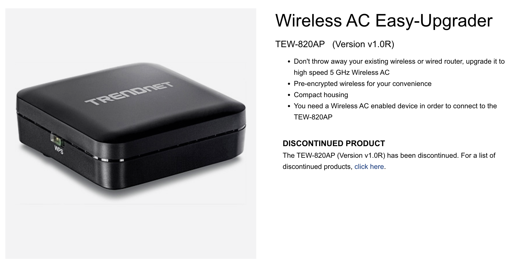
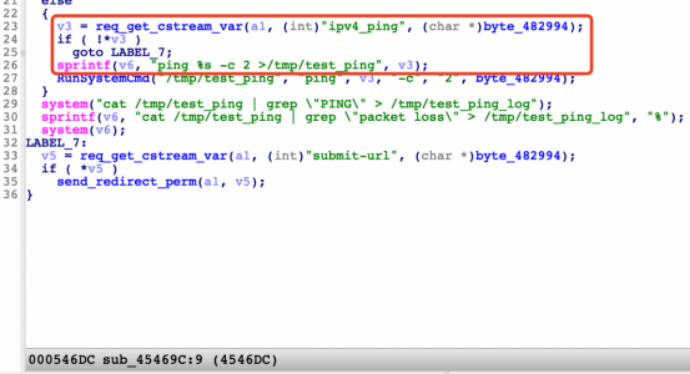

# TRENDNet AP buffer overflow vulnerabilities



## Overview

* Type: buffer overflow
* Supplier: TRENDNet  (https://www.trendnet.com/)
* Product: TRENDNet TEW-820AP (Version v1.0R)
* Firmware download: https://downloads.trendnet.com/tew-820ap/firmware/tew-820apv1_(fw1.01b01).zip
* affect version: TRENDNet TEW-820AP 1.01.B01


## Description

### 1. Vulnerability Details

A stack overflow vulnerability exists in TrendNet Wireless AC Easy-Upgrader TEW-820AP (Version v1.0R, firmware version 1.01.B01) which may result in remote code execution or denial of service. The issue exists in the binary "boa" which resides in "/bin" folder, and the binary is responsible for serving http connection received by the device. While processing the post reuqest "/boafrm/formSystemCheck", the value of "ipv4_ping" parameter which can be arbitrarily long is copied onto stack memory by "sprintf" function (as shown at line 20 of Figure B), and could lead to a buffer overflow. The attackers can construct a payload to carry out arbitrary code attacks.



Figure A: The decompiled code which is vulnerable.


### 2. Reproduce and POC

To reproduce the vulnerability, the following steps can be followed:

1. Start frimware through QEMU system or other methods (real device)
2. Use the default username and password to login web.
3. Execute the poc script POC_for_formSystemCheck.py as follows:

```bash
python3 POC_for_formSystemCheck.py 192.168.1.1
```

